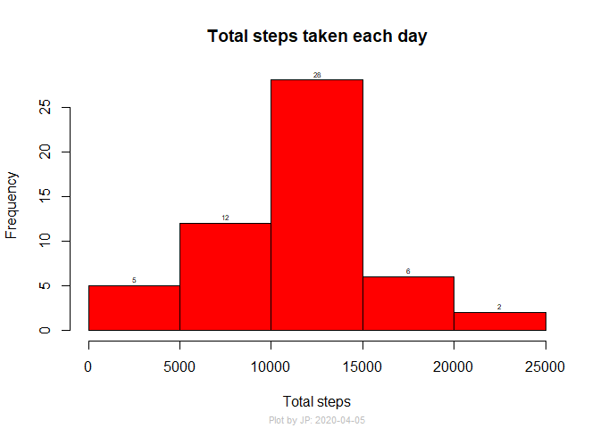

## Loading required libraries and setup


```r
library(dplyr)
library(lattice)
options(scipen=999)
```

## Loading and preprocessing the data

Read data:

```r
unzip("activity.zip", overwrite = T)

ad <- read.csv("activity.csv")
```

Convert to tbl_df and tidy the data:

```r
tdf_ad <- tbl_df(ad)

colnames(tdf_ad) <- toupper(colnames(tdf_ad))

tdf_ad <- tdf_ad %>% 
    mutate(DATE = as.Date(DATE, "%Y-%m-%d"))
```


## What is mean total number of steps taken per day?

Prepare data to show total steps per day:

```r
tdf_adm <- tdf_ad %>% 
    select(DATE, STEPS) %>% 
    filter(!is.na(STEPS)) %>% 
    group_by(DATE) %>% 
    summarise(STEPS = sum(STEPS))
```

Histogram of total steps taken each day:

```r
par(col.sub = "grey", cex.sub = 0.7)
hist <- with(tdf_adm, hist(STEPS, col = "Red", 
          xlab = "Total steps", 
          ylab = "Frequency", 
          main = "Total steps taken each day", 
          sub = paste("Plot by JP: ", Sys.Date(), sep = "")))
with(hist, text(x = mids, 
                y = counts, 
                labels = counts, 
                cex = 0.5, 
                pos = 3, 
                offset = 0.20))
```

<!-- -->

Mean of steps taken per day: **10766.1886792**

Median of steps taken per day: **10765**

## What is the average daily activity pattern?

Prepare data to show average steps across all days in 5 min interval:

```r
tdf_admi <- tdf_ad %>% 
    select(STEPS, INTERVAL) %>% 
    filter(!is.na(STEPS)) %>% 
    group_by(INTERVAL) %>% 
    summarise(STEPS = mean(STEPS))
```

Time series graph of average steps across all days in 5 min interval:

```r
par(col.sub = "grey", cex.sub = 0.7)
with(tdf_admi, plot(INTERVAL, STEPS, 
                   col = "Red", 
                   xlab = "5 Min Interval", 
                   ylab = "Average steps across all days", 
                   main = "Average steps taken in 5 min interval", 
                   sub = paste("Plot by JP: ", Sys.Date(), sep = ""), 
                   type = "l"))
```

<!-- -->

Interval having Max average steps across all days: **835**

## Imputing missing values

##### Fill missing values for an interval by taking average of steps taken in that interval:

- Create new dataset:

```r
tdf_admd <- tdf_ad
```

- Find indexes where steps are NA:

```r
ina <- which(is.na(tdf_admd$STEPS))
```

- Filter rows where steps are NA:

```r
inad <- tdf_admd[ina, ]
```

- Take dataset of average steps by interval and filter only intervals where steps are NA:

```r
inads <- tdf_admi[which(tdf_admi$INTERVAL %in% inad$INTERVAL), ]
```

- Replace all those NA in steps with average steps of interval matching the interval of NA steps:

```r
for (i in ina) {
    if (tdf_admd[[3]][i] %in% inads$INTERVAL) {
        tdf_admd[[1]][[i]] = inads[[1]][[which(tdf_admd[[3]][i] 
                                               %in% inads$INTERVAL)]]
    }
}
```

Prepare data to show total steps per day with missing values imputed:

```r
tdf_admdm <- tdf_admd %>% 
    select(STEPS, DATE) %>% 
    filter(!is.na(STEPS)) %>% 
    group_by(DATE) %>% 
    summarise(STEPS = sum(STEPS))
```

Histogram of total steps taken each day with missing values imputed:

```r
par(col.sub = "grey", cex.sub = 0.7)
hist <- with(tdf_admdm, hist(STEPS, col = "Red", 
          xlab = "Total steps", 
          ylab = "Frequency", 
          main = "Total steps taken each day", 
          sub = paste("Plot by JP: ", Sys.Date(), sep = "")))
with(hist, text(x = mids, 
                y = counts, 
                labels = counts, 
                cex = 0.5, 
                pos = 3, 
                offset = 0.20))
```

<!-- -->

Mean of steps taken per day: **9354.2295082**

Median of steps taken per day: **10395**

**Comparing from previous data we can see that the mean of steps taken per day increases by a few Kilo units after imputing the missing values.**

## Are there differences in activity patterns between weekdays and weekends?

Add two factor column to the data which would indicate a date to be a weekday or weekend: 


```r
tdf_admd <- mutate(tdf_admd, DAY = "weekday")
iwd <- which(weekdays(tdf_admd$DATE, T) %in% c("Sat", "Sun"))
tdf_admd[iwd, "DAY"] <- "weekend"
tdf_admd <- mutate(tdf_admd, DAY = as.factor(DAY))
```

Prepare data to show average steps by weekday/weekend for 5 min interval with missing values imputed:

```r
tdf_admdw <- tdf_admd %>% 
    filter(!is.na(STEPS)) %>% 
    group_by(INTERVAL, DAY) %>% 
    summarise(STEPS = mean(STEPS))
```

Panel plot comparing average steps taken over a weekday/weekend in 5 min interval:

```r
s <- trellis.par.get("par.sub.text")
s$cex <- 0.7
s$col <- "grey"
trellis.par.set("par.sub.text", s)
with(tdf_admdw, xyplot(STEPS~INTERVAL|DAY, type = "l", 
                       xlab = "Interval", 
                       ylab = "Average steps", 
                       sub = paste("Plot by JP: ", Sys.Date(), sep = "")))
```

<!-- -->

**It clearly appears that there are differences in activity patterns on weekdays/weekend.**
